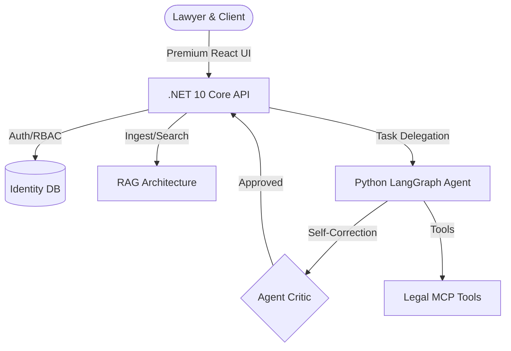

# ⚖️ Shingi AI – Next-Gen Agentic Legal Intelligence

[](https://github.com/jakecosilla/shingi-ai)
[](https://github.com/jakecosilla/shingi-ai)
[](https://opensource.org/licenses/MIT)

> **"Accelerating Justice through Agentic AI"**
> Shingi AI is an enterprise-grade platform that empowers law firms with autonomous AI agents, secure role-based portals, and advanced retrieval-augmented generation (RAG).


---

## 🌟 Why Shingi AI?

In the modern legal landscape, speed and security are paramount. Shingi AI bridges the gap between complex legal workflows and cutting-edge artificial intelligence.

- **🛡️ Secure by Design:** Built on .NET 10 Identity with JWT and RBAC.
- **🧠 Agentic Intelligence:** Powered by Python LangGraph for multi-agent reasoning.
- **📱 100% Mobile Optimized:** Premium glassmorphism UI designed for busy lawyers and their clients.
- **⚡ Local-First AI:** Flexible support for local LLMs via Ollama or cloud models via OpenAI.

---

## 🏗️ Architecture at a Glance



---

## 🧩 Core Components

### 🏛️ The Backend (.NET 10)
A high-performance orchestration engine managing identity, vector storage, and business logic.
- **Identity:** Full RBAC for secure separation between Lawyer and Customer portals.
- **AI Integration:** Exposes legal-specific tools via a decoupled MCP-style architecture.
- **Scalar Docs:** Modern, interactive API references out of the box.

### 🤖 The Agent (Python)
An advanced LangGraph system that doesn't just answer—it **reasons**.
- **Planner-Executor-Critic:** A sophisticated multi-agent loop that self-corrects based on tool results.
- **Observability:** Full execution tracing with latency and retry metrics.

### 🎨 The UI (React 19)
A "wow" factor interface that feels industrial yet fluid.
- **Glassmorphism Design:** Dark mode by default with vibrant, functional accent colors.
- **Customer Portal:** Dedicated portal for clients to track case progress and download *human-lawyer approved* AI results.

---

## 🚀 One-Command Quickstart

The entire platform is containerized and ready for dev or prod:

```bash
# Clone the repository
git clone https://github.com/jakecosilla/shingi-ai.git
cd shingi-ai

# Start everything with Docker
docker-compose up -d
```

*Or use our unified startup script:*
```bash
./start.sh
```

---

## ⚙️ Service Ports

| Service | Port | Description |
| :--- | :--- | :--- |
| **Frontend** | `3001` | React Dashboard & Client Portal |
| **Backend API** | `5076` | .NET Core Identity & RAG Engine |
| **Agent API** | `8000` | Python LangGraph Execution |

---

## 🤝 Contributing

We are building the future of legal tech. Contributions, issues, and feature requests are welcome!
Feel free to check the [issues page](https://github.com/jakecosilla/shingi-ai/issues).

---

## 📜 License

Copyright © 2026 **Shingi AI Team**.
This project is [MIT](https://opensource.org/licenses/MIT) licensed.
