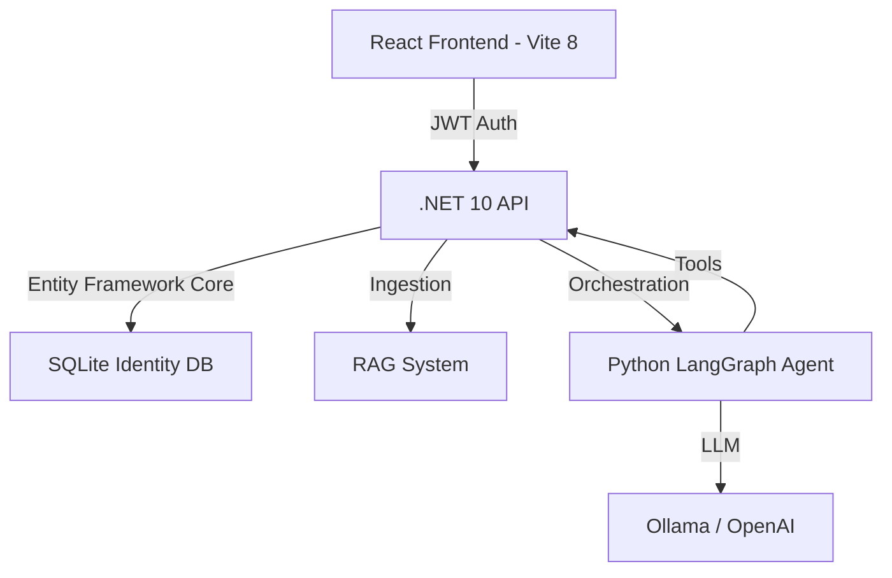

# 🚀 Shingi AI – Agentic Legal AI Platform

Shingi AI is an enterprise-grade agentic AI platform for law firms, combining a secure .NET 10 backend with Python LangGraph orchestration and a premium mobile-friendly React frontend.

---

## 🏗️ Architecture



---

## 🔥 Key Features

### 🔐 Enterprise Security
- **JWT Authentication:** Stateless, secure token-based access with 24-hour expiry.
- **Identity Management:** Full ASP.NET Core Identity integration for users and roles.
- **RBAC (Role-Based Access Control):** Granular access policy for **Lawyers** (Drafting, Tools, AI) and **Customers** (Portal, Cases, Approved Docs).
- **Secure CORS:** Strict origin policy for frontend-to-backend communication.
- **Auto-Seeding:** Automatic generation of 'Admin' and 'User' roles on startup.

### 📱 Premium Frontend (NEW)
- **Mobile-First Design:** Fully responsive glassmorphism UI with slide-out navigation for mobile.
- **Customer Portal:** Dedicated interface for clients to track case progress and download lawyer-approved results.
- **Lawyer Dashboard:** AI-powered workflow management with real-time agent observability.
- **React 19 + Framer Motion:** Fluid animations and micro-interactions for a premium feel.

### ✅ Agentic AI (LangGraph)
- **Multi-agent system:** Planner, Executor, and Critic nodes for high-accuracy reasoning.
- **Self-Healing:** Automatic retry loops and conditional branching based on agent critique.
- **MCP-style Tools:** Tool registry pattern decoupled from the orchestration logic.

---

## 🏗️ Project Structure

```text
shingi-ai/
├── src/
│   ├── frontend/             # React 19 + Vite 8 (Premium UI)
│   ├── backend/              # .NET 10 API (Security, Identity, RAG)
│   └── agent/                # Python LangGraph (Orchestration)
```

---

## ⚙️ Setup & Execution

### 1️⃣ Database Setup
Ensure the SQLite database is initialized:
```bash
cd src/backend
dotnet ef database update --project ShingiAI.Infrastructure --startup-project ShingiAI.Api
```

### 2️⃣ Start Backend (.NET)
```bash
cd src/backend/ShingiAI.Api
dotnet run
```
- **API URL:** `http://localhost:5076`
- **Documentation:** `http://localhost:5076/scalar/v1` (Scalar)

### 3️⃣ Start Agent (Python)
```bash
cd src/agent
source venv/bin/activate
uvicorn app.main:app --reload --port 8000
```

### 4️⃣ Start Frontend (React)
```bash
cd src/frontend
npm install
npm run dev -- --port 3001
```
- **App URL:** `http://localhost:3001`

---

## 🧪 Security API Examples

### Register User
```bash
curl -X POST http://localhost:5076/auth/register \
  -H "Content-Type: application/json" \
  -d '{"email":"lawyer@firm.com", "password":"Password123!", "fullName":"Jane Doe"}'
```

### Login (Obtain JWT)
```bash
curl -X POST http://localhost:5076/auth/login \
  -H "Content-Type: application/json" \
  -d '{"email":"lawyer@firm.com", "password":"Password123!"}'
```

---

## 🎨 Design Principles
- **Aesthetic Excellence:** Modern glassmorphism dark theme.
- **Separation of Concerns:** .NET for security/data, Python for "intelligence".
- **Agent-First:** All business logic is exposed as tools for the LLM to decide on actions.

---

## 🏁 Status
**Production-Ready Enterprise Platform.**
Current Version: 1.1.0 (Security & Portal Update)
